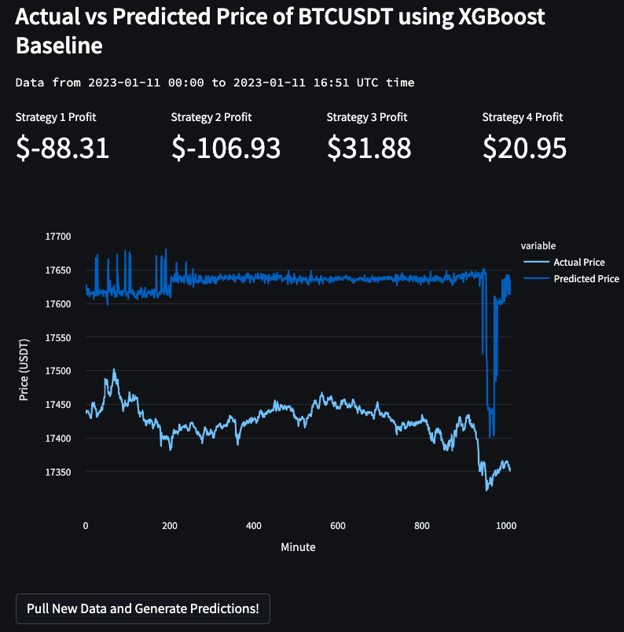

bitcoin-bro
[](https://zenodo.org/badge/latestdoi/586732017)
==============================

Time-series prediction for Bitcoin (BTCUSDT) price, with data scraped from Binance API

[Real-time Dashboard](https://jonathanlimsc-bitcoin-bro-v1.streamlit.app/) | [Blogpost](https://jonathanlimsc.com/projects/bitcoin-bro)



## Installation

1. Create a conda environment and pip install dependencies.
```
conda create -n bitcoin-bro python=3.8
conda activate bitcoin-bro
pip install -r requirements.txt
```

2. Run notebooks in the `/notebooks` directory.
```
jupyter notebook
```

3. Run the streamlit application to see the real-time predictions
```
streamlit run streamlit_app.py
```

## Project Organization
------------

    ├── LICENSE
    ├── Makefile           <- Makefile with commands like `make data` or `make train`
    ├── README.md          <- The top-level README for developers using this project.
    ├── assets             <- Contains static assets such as images.
    ├── data
    │   ├── external       <- Data from third party sources.
    │   ├── processed      <- The final, canonical data sets for modeling.
    │   └── raw            <- The original, immutable data dump.
    │
    ├── docs               <- A default Sphinx project; see sphinx-doc.org for details
    │
    ├── models             <- Trained and serialized models, model predictions, or model summaries
    │
    ├── notebooks          <- Jupyter notebooks showing experiments and analysis
    │   ├── 1.0-Downloading-Data                <- Shows how raw data is downloaded from Binance API
    │   ├── 2.0-Feature-Engineering             <- Shows how raw data is transformed by feature engineering
    │   ├── 3.0-Modelling-XGB-Baseline          <- Shows the training and hyperparam tuning of XGBoost baseline
    │   └── 4.0-Generate-Real-Time-Predictions  <- Shows how to generate real-time predictions
    │
    ├── references         <- Data dictionaries, manuals, and all other explanatory materials.
    │
    ├── reports            <- Generated analysis as HTML, PDF, LaTeX, etc.
    │   └── figures        <- Generated graphics and figures to be used in reporting
    │
    ├── requirements.txt   <- The requirements file for reproducing the analysis environment, e.g.
    │                         generated with `pip freeze > requirements.txt`
    │
    ├── setup.py           <- makes project pip installable (pip install -e .) so src can be imported
    ├── src                <- Source code for use in this project.
    │   ├── __init__.py    <- Makes src a Python module
    │   │
    │   ├── data           <- Scripts to download or generate data
    │   │   └── binance_downloader.py           <- Contains functions to download data from Binance API
    │   │
    │   ├── features       <- Scripts to turn raw data into features for modeling
    │   │   ├── feature_generator.py            <- Contains functions to generate features
    |   |   └── utilities.py                    <- Contains utility functions such as time converting
    │   │
    │   ├── models         <- Scripts to train models and then use trained models to make
    │   │   │                 predictions
    │   │   └── metrics.py                      <- Contains functions to compute model performance metrics 
    │   │
    │   └── visualization  <- Scripts to create exploratory and results oriented visualizations
    │       └── plot_generator.py               <- Contains functions to generate plots
    │
    └── tox.ini            <- tox file with settings for running tox; see tox.readthedocs.io


--------

<p><small>Project based on the <a target="_blank" href="https://drivendata.github.io/cookiecutter-data-science/">cookiecutter data science project template</a>. #cookiecutterdatascience</small></p>
